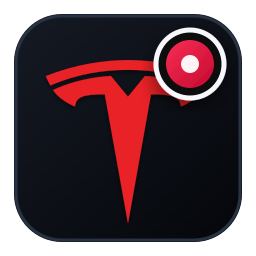
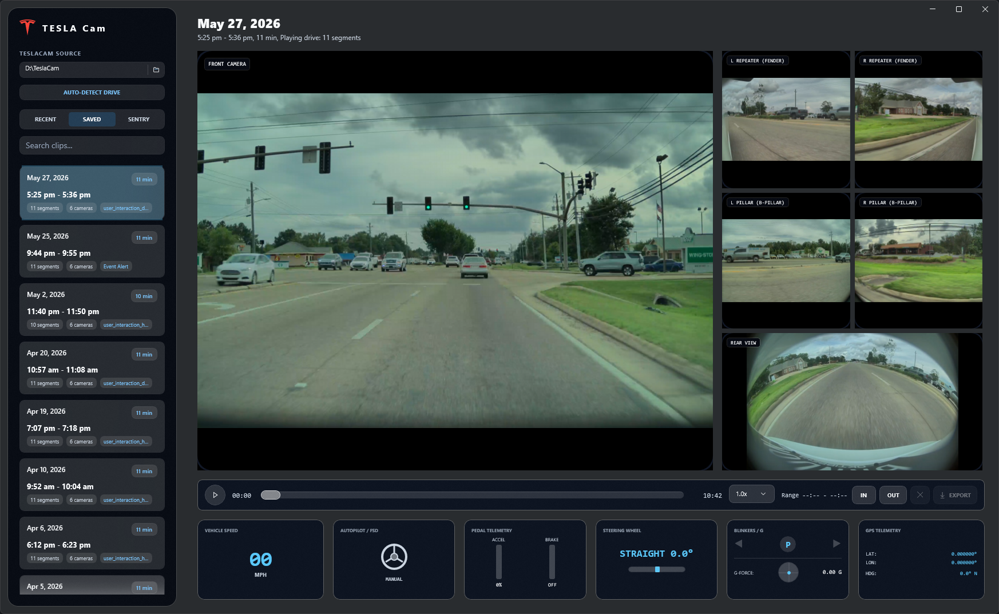
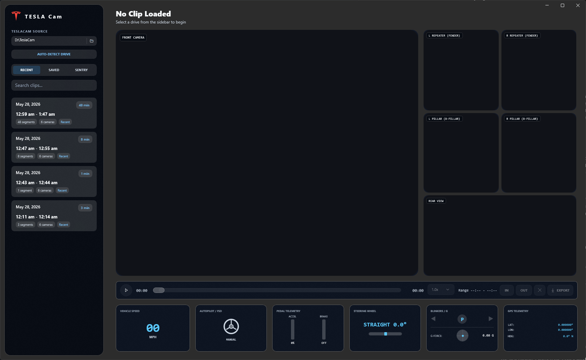

<div align="center">
  
  <h1>TESLA Cam</h1>
  <p><strong>Free source-available Windows TeslaCam viewer for stitched drive playback, multi-camera review, telemetry, markers, and export.</strong></p>
  <p>
    <a href="https://github.com/bt1142msstate/TeslaCamViewer/actions/workflows/windows-build.yml"></a>
    <a href="https://github.com/bt1142msstate/TeslaCamViewer/releases"></a>
    
    
    
  </p>
</div>



TESLA Cam is a Windows desktop viewer for TeslaCam footage. It is built with WinUI 3 and Windows App SDK, and focuses on turning Tesla's split camera files into a drive-centered viewing experience.

The core app is intended to stay free. The free version should not add ads,
promotional overlays, export watermarks, or forced branding to your clips.
Future subscriptions and donations may support cloud-assisted features,
development, signing, hosting, testing, and upkeep, but they should be optional.

This project is not affiliated with, endorsed by, or sponsored by Tesla, Inc. Tesla and related vehicle names are trademarks of their respective owners.

The public repository uses a working project name. The published app is planned
to ship under a different final name, and a macOS version is planned after the
Windows app is further along. A public GitHub Pages preview site is available at
https://bt1142msstate.github.io/TeslaCamViewer/ and should be refreshed once the
final name, logo, screenshots, and privacy URL are ready.

Project owner: [Brandon Temple](https://brandontemple.com/). Contact links are
available on the [portfolio contact section](https://brandontemple.com/#contact).

## Screenshots



## Categories And Tags

Categories: TeslaCam viewer, dashcam footage review, multi-camera video player,
vehicle telemetry, Windows desktop app, video stitching, clip export, marker
based editing, Sentry Mode review.

Tags: `tesla`, `teslacam`, `tesla-dashcam`, `dashcam-viewer`, `winui3`,
`windows-app-sdk`, `dotnet`, `ffmpeg`, `mp4`, `telemetry`, `video-stitching`,
`video-export`, `sentry-mode`, `source-available`, `github-releases`, `winget`.

## Current Features

- Scan a mounted TeslaCam drive, copied TeslaCam folder, or supported ZIP archive.
- Group one-minute TeslaCam segments into drive sessions.
- Stitch each drive into continuous camera feeds for smoother playback.
- Show front, rear, repeater, and pillar camera views together.
- Swap the main camera view by clicking an auxiliary view.
- Display embedded telemetry including speed, steering, gear, pedals, blinkers, GPS, heading, and autonomy state.
- Scrub across the full drive timeline.
- Add IN and OUT markers for exporting.
- Export the current view as MP4.
- Export all views into a compressed ZIP folder.
- Validate post-export telemetry preservation.
- Use a local cache and background cleanup helper for stitched clips.

## Windows Support

- Windows 10 version 1809 or newer.
- x64 builds.
- Windows App SDK / WinUI 3 desktop app.
- Default local developer build is unpackaged.
- Microsoft Store packaging is planned through MSIX.

## Install From GitHub

Users do not need Visual Studio to try a published GitHub release. The long-term
recommended command-line path is WinGet after the final package name, signing,
and Windows Package Manager manifest are ready:

```powershell
winget install --id BrandonTemple.FinalAppName -e
```

Until that package exists, download `Install-TESLA-Cam.ps1` from the
[latest GitHub Release](https://github.com/bt1142msstate/TeslaCamViewer/releases)
and run it in PowerShell. It installs the selected non-draft release to
`%LOCALAPPDATA%\Programs\TESLA Cam`, verifies the package SHA-256 when GitHub
provides an asset digest, and creates app shortcuts. See [INSTALL.md](INSTALL.md)
for preview install, manual install, stable-only install, and uninstall details.

## Build

Open the project in Visual Studio 2026 or newer with the Windows App SDK workload installed, then build `TeslaCamViewer.csproj` for `x64`.

Command-line build used during development:

```powershell
& 'C:\Program Files\Microsoft Visual Studio\18\Community\MSBuild\Current\Bin\amd64\MSBuild.exe' TeslaCamViewer.csproj /t:Build /p:Configuration=Release /p:Platform=x64 /v:minimal
```

## Microsoft Store Plan

The Windows Store version is planned to be free and published under a final
name that differs from this repository name. The free version should remain
useful without a subscription and should not add ads, promotional overlays,
export watermarks, or forced branding. A future optional subscription may add
faster and more accurate cloud-assisted visual context using Gemini, plus Tesla
API powered features. Donations may also be offered for people who want to
support development and upkeep.

See [STORE_READINESS.md](STORE_READINESS.md) for the current packaging and certification checklist.

## Roadmap

See [ROADMAP.md](ROADMAP.md).

## Contributing

See [CONTRIBUTING.md](CONTRIBUTING.md). Do not attach private TeslaCam footage,
GPS traces, faces, license plates, or other sensitive media unless you are
comfortable making it public.

## Architecture

See [ARCHITECTURE.md](ARCHITECTURE.md).

## Privacy

See [PRIVACY.md](PRIVACY.md). The current app works locally and does not intentionally upload clips or telemetry.

## License

This project is source-available, not open source. You may inspect, build, run,
and modify it for personal, non-commercial use. You may not sell, sublicense,
redistribute, publish modified builds, or present it as your own product without
written permission. See [LICENSE](LICENSE).
